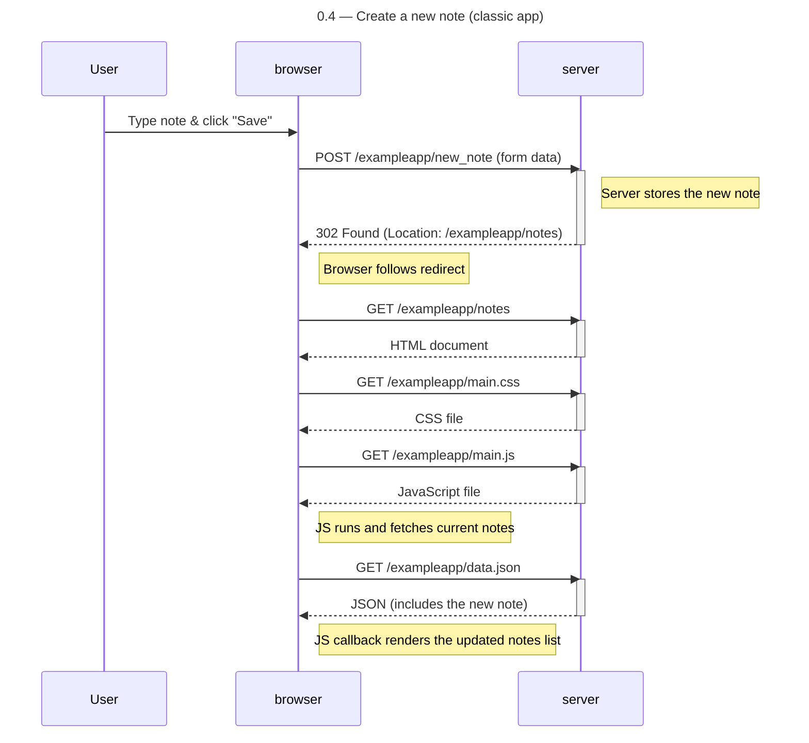

```mermaid
sequenceDiagram
    title 0.4 — Create a new note (classic app)
    participant User
    participant browser
    participant server

    User->>browser: Type note & click "Save"
    browser->>server: POST /exampleapp/new_note (form data)
    activate server
    Note right of server: Server stores the new note
    server-->>browser: 302 Found (Location: /exampleapp/notes)
    deactivate server

    Note right of browser: Browser follows redirect
    browser->>server: GET /exampleapp/notes
    activate server
    server-->>browser: HTML document
    deactivate server

    browser->>server: GET /exampleapp/main.css
    activate server
    server-->>browser: CSS file
    deactivate server

    browser->>server: GET /exampleapp/main.js
    activate server
    server-->>browser: JavaScript file
    deactivate server

    Note right of browser: JS runs and fetches current notes
    browser->>server: GET /exampleapp/data.json
    activate server
    server-->>browser: JSON (includes the new note)
    deactivate server

    Note right of browser: JS callback renders the updated notes list
```