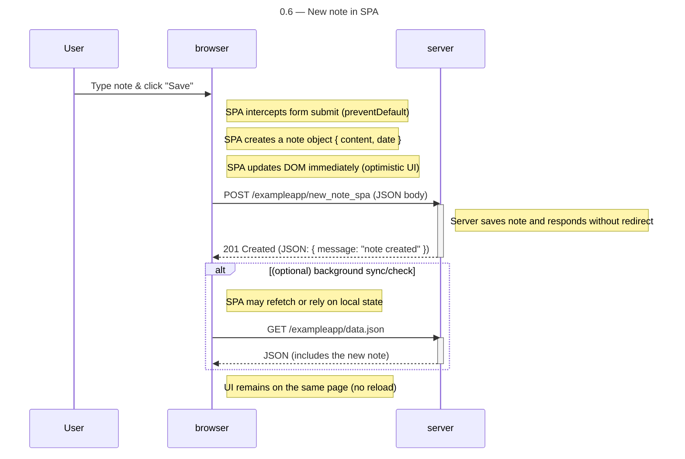

```mermaid
sequenceDiagram
    title 0.6 — New note in SPA
    participant User
    participant browser
    participant server

    User->>browser: Type note & click "Save"
    Note right of browser: SPA intercepts form submit (preventDefault)
    Note right of browser: SPA creates a note object { content, date }
    Note right of browser: SPA updates DOM immediately (optimistic UI)

    browser->>server: POST /exampleapp/new_note_spa (JSON body)
    activate server
    Note right of server: Server saves note and responds without redirect
    server-->>browser: 201 Created (JSON: { message: "note created" })
    deactivate server

    alt (optional) background sync/check
        Note right of browser: SPA may refetch or rely on local state
        browser->>server: GET /exampleapp/data.json
        activate server
        server-->>browser: JSON (includes the new note)
        deactivate server
    end

    Note right of browser: UI remains on the same page (no reload)
```