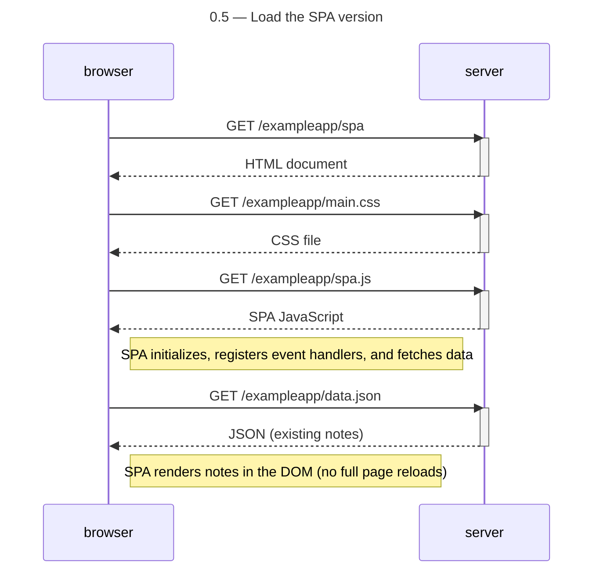

```mermaid
sequenceDiagram
    title 0.5 — Load the SPA version
    participant browser
    participant server

    browser->>server: GET /exampleapp/spa
    activate server
    server-->>browser: HTML document
    deactivate server

    browser->>server: GET /exampleapp/main.css
    activate server
    server-->>browser: CSS file
    deactivate server

    browser->>server: GET /exampleapp/spa.js
    activate server
    server-->>browser: SPA JavaScript
    deactivate server

    Note right of browser: SPA initializes, registers event handlers, and fetches data
    browser->>server: GET /exampleapp/data.json
    activate server
    server-->>browser: JSON (existing notes)
    deactivate server

    Note right of browser: SPA renders notes in the DOM (no full page reloads)
```